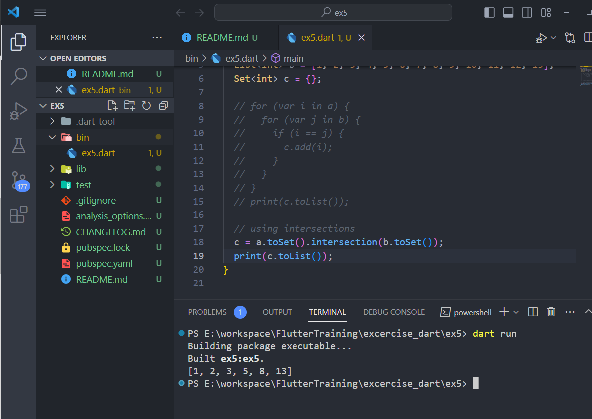

# Exercise 5

Take two lists, for example:

a = [1, 1, 2, 3, 5, 8, 13, 21, 34, 55, 89]

b = [1, 2, 3, 4, 5, 6, 7, 8, 9, 10, 11, 12, 13]
and write a program that returns a list that contains only the elements that are common between them (without duplicates). Make sure your program works on two lists of different sizes.

